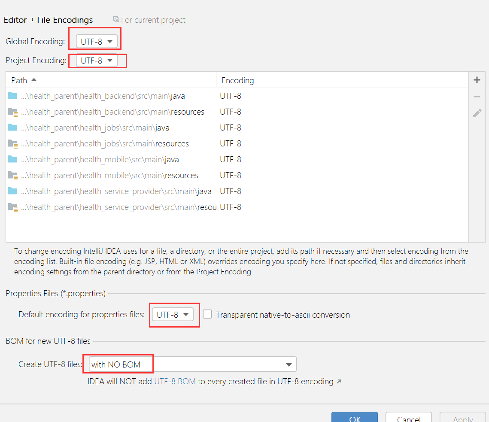
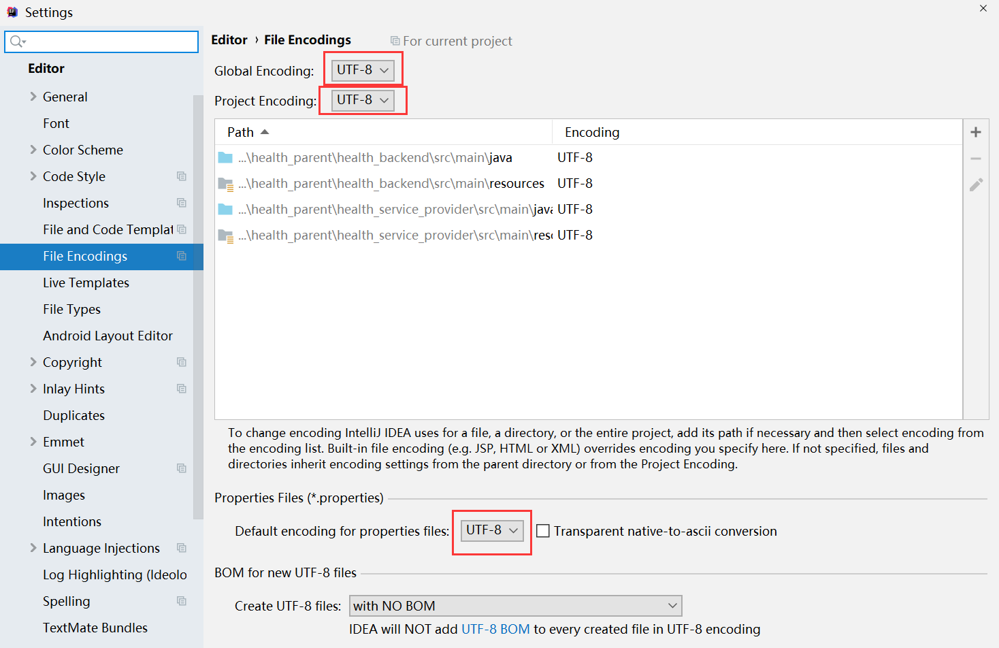
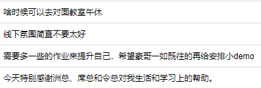

# 传智健康项目 第7章 页面静态化 模板+数据=文本!

今日目标：

1页面静态化-了解

2freemarker

3freemarker入门

4freemarker指令

5移动端静态页面-掌握


## 1. 页面静态化介绍-理念

本章课程中我们已经实现了移动端套餐列表页面和套餐详情页面的动态展示。但是我们需要思考一个问题，就是对于这两个页面来说，每次用户访问这两个页面都需要查询数据库获取动态数据进行展示，而且这两个页面的访问量是比较大的，这就对数据库造成了很大的访问压力，并且数据库中的数据变化频率并不高。那我们需要通过什么方法为数据库减压并提高系统运行性能呢？答案就是页面静态化。

**举例**：京东商品详情页，都是xxx.html

页面静态化其实就是将原来的动态网页(例如通过ajax请求动态获取数据库中的数据并展示的网页)改为通过静态化技术生成的静态网页，这样用户在访问网页时，服务器直接给用户响应静态html页面，没有了动态查询数据库的过程。

那么这些静态HTML页面还需要我们自己去编写吗？其实并不需要，

我们可以通过专门的页面静态化技术帮我们生成所需的静态HTML页面，例如：Freemarker、thymeleaf、jsp、velocity等。


## 2. Freemarker介绍

FreeMarker 是一个用 Java 语言编写的模板引擎，它基于模板来生成文本输出。FreeMarker与 Web 容器无关，即在 Web 运行时，它并不知道 Servlet 或 HTTP。它不仅可以用作表现层的实现技术，而且还可以用于生成 XML，JSP 或 Java 等。


**记住这句话**： 模板+数据=文本

## 3. Freemarker入门案例

### 3.1 环境搭建

创建maven工程freemarkerdemo并导入Freemarker的maven坐标

```xml
    <dependencies>
        <dependency>
            <groupId>org.freemarker</groupId>
            <artifactId>freemarker</artifactId>
            <version>2.3.23</version>
        </dependency>
    </dependencies>
```

### 3.2 创建模板文件

模板文件中有四种元素：

1、文本，直接输出的部分 

2、注释，即<#--...-->格式不会输出 

3、插值（Interpolation）：即${..}部分,将使用数据模型中的部分替代输出

4、FTL指令：FreeMarker指令，和HTML标记类似，名字前加#予以区分，不会输出


Freemarker的模板文件后缀可以任意，一般建议为**ftl**。


在D盘创建ftl目录，在ftl目录中创建名称为test.ftl的模板文件，内容如下：

```html
<html>
<head>
    <meta charset="utf-8">
    <title>Freemarker入门</title>
</head>
<body>
    <#--我只是一个注释，我不会有任何输出  -->
    ${name}你好，${message}
</body>
</html>
```

### 3.3 生成文件

使用步骤：

第一步：创建一个 Configuration 对象，直接 new 一个对象。构造方法的参数就是 freemarker的版本号。

第二步：设置模板文件所在的路径。

第三步：设置模板文件使用的字符集。一般就是 utf-8。

第四步：加载一个模板，创建一个模板对象。

第五步：创建一个模板使用的数据集，可以是 pojo 也可以是 map。一般是 Map。

第六步：创建一个 Writer 对象，一般创建 FileWriter 对象，指定生成的文件名。

第七步：调用模板对象的 process 方法输出文件。

第八步：关闭流。

```java
public static void main(String[] args) throws Exception{
    //1.创建配置类
    Configuration configuration=new Configuration(Configuration.getVersion());
    //2.设置模板所在的目录 
    configuration.setDirectoryForTemplateLoading(new File("D:\\ftl"));
    //3.设置字符集
    configuration.setDefaultEncoding("utf-8");
    //4.加载模板
    Template template = configuration.getTemplate("test.ftl");
    //5.创建数据模型
    Map map=new HashMap();
    map.put("name", "张三");
    map.put("message", "欢迎来到传智播客！");
    //6.创建Writer对象
    Writer out =new FileWriter(new File("d:\\test.html"));
    //7.输出
    template.process(map, out);
    //8.关闭Writer对象
    out.close();
}
```

上面的入门案例中Configuration配置对象是自己创建的，字符集和模板文件所在目录也是在Java代码中指定的。在项目中应用时可以将Configuration对象的创建交由Spring框架来完成，并通过依赖注入方式将字符集和模板所在目录注入进去。

注意编码：



## 4. Freemarker指令

### 4.1 assign指令

assign指令用于在页面上定义一个变量

（1）定义简单类型

```html
<#assign linkman="周先生">
联系人：${linkman}
```

（2）定义对象类型

```html
<#assign info={"mobile":"13812345678",'address':'北京市昌平区'} >
电话：${info.mobile}  地址：${info.address}
```

### 4.2 include指令

include指令用于模板文件的嵌套。

**用处**：页头页脚。

（1）创建模板文件head.ftl

```html
<h1>黑马程序员</h1>
```

（2）修改入门案例中的test.ftl，在test.ftl模板文件中使用include指令引入上面的模板文件

```html
<#include "head.ftl"/>
```

### 4.3 if指令

if指令用于判断

（1）在模板文件中使用if指令进行判断

```html
<#if success=true>
  你已通过实名认证
<#else>  
  你未通过实名认证
</#if>
```

（2）在java代码中为success变量赋值

```java
map.put("success", true);
```

在freemarker的判断中，可以使用= 也可以使用==

（3）模板文件中也可以定义出条件--不常用

```xml
<#assign success=false>
```

### 4.4 list指令

list指令用于遍历

（1）在模板文件中使用list指令进行遍历

```html
<#list goodsList as goods>
  商品名称： ${goods.name} 价格：${goods.price}<br>
</#list>
```

（2）在java代码中为goodsList赋值

```java
List goodsList=new ArrayList();

Map goods1=new HashMap();
goods1.put("name", "苹果");
goods1.put("price", 5.8);

Map goods2=new HashMap();
goods2.put("name", "香蕉");
goods2.put("price", 2.5);

Map goods3=new HashMap();
goods3.put("name", "橘子");
goods3.put("price", 3.2);

goodsList.add(goods1);
goodsList.add(goods2);
goodsList.add(goods3);

map.put("goodsList", goodsList);
```

## 5. 生成移动端静态页面

前面我们已经学习了Freemarker的基本使用方法，下面我们就可以将Freemarker应用到项目中，帮我们生成移动端套餐列表静态页面和套餐详情静态页面。接下来我们需要思考几个问题：

（1）什么时候生成静态页面比较合适呢？

（2）将静态页面生成到什么位置呢？

（3）应该生成几个静态页面呢？

对于第一个问题，应该是当套餐数据发生改变时，需要生成静态页面，即我们通过后台系统修改套餐数据（包括新增、删除、编辑）时。

对于第二个问题，如果是在开发阶段可以将文件生成到项目工程中，如果上线后可以将文件生成到移动端系统运行的tomcat中。

对于第三个问题，套餐列表只需要一个页面就可以了，在这个页面中展示所有的套餐列表数据即可。套餐详情页面需要有多个，即一个套餐应该对应一个静态页面。

  

### 5.1 环境搭建

在health_common工程的pom文件中导入Freemarker的maven坐标

```xml
<dependency>
  <groupId>org.freemarker</groupId>
  <artifactId>freemarker</artifactId>
  <version>2.3.23</version>
</dependency>
```

### 5.2 创建模板文件

在health_service_provider工程的WEB-INF目录中创建ftl目录，在ftl目录中创建模板文件mobile_setmeal.ftl和mobile_setmeal_detail.ftl文件，前者是用于生成套餐列表页面的模板文件，后者是生成套餐详情页面的模板文件

（1）**套餐列表模板** mobile_setmeal.ftl 

```html
<!DOCTYPE html>
<html lang="zh-CN">
<head>
    <meta charset="utf-8">
    <meta http-equiv="X-UA-Compatible" content="IE=edge">
    <!-- 上述3个meta标签*必须*放在最前面，任何其他内容都*必须*跟随其后！ -->
    <meta name="viewport" content="width=device-width, initial-scale=1.0, maximum-scale=1.0, user-scalable=0,user-scalable=no,minimal-ui">
    <meta name="description" content="">
    <meta name="author" content="">
    <link rel="icon" href="../img/asset-favico.ico">
    <title>预约</title>
    <link rel="stylesheet" href="../css/page-health-order.css" />
</head>
<body data-spy="scroll" data-target="#myNavbar" data-offset="150">
<div class="app" id="app">
    <!-- 页面头部 -->
    <div class="top-header">
        <span class="f-left"><i class="icon-back" onclick="history.go(-1)"></i></span>
        <span class="center">传智健康</span>
        <span class="f-right"><i class="icon-more"></i></span>
    </div>
    <!-- 页面内容 -->
    <div class="contentBox">
        <div class="list-column1">
            <ul class="list">
                <#list setmealList as setmeal>
                    <li class="list-item">
                        <a class="link-page" href="setmeal_detail_${setmeal.id}.html">
                            
                            <div class="item-body">
                                <h4 class="ellipsis item-title">${setmeal.name}</h4>
                                <p class="ellipsis-more item-desc">${setmeal.remark}</p>
                                <p class="item-keywords">
                                    <span>
                                        <#if setmeal.sex == '0'>
                                            性别不限
                                            <#else>
                                                <#if setmeal.sex == '1'>
                                                男
                                                <#else>
                                                女
                                                </#if>
                                        </#if>
                                    </span>
                                    <span>${setmeal.age}</span>
                                </p>
                            </div>
                        </a>
                    </li>
                </#list>
            </ul>
        </div>
    </div>
</div>
<!-- 页面 css js -->
<script src="../plugins/vue/vue.js"></script>
<script src="../plugins/vue/axios-0.18.0.js"></script>
</body>
```

注意上面模板文件中每个套餐对应的超链接如下：

```html
<a class="link-page" href="setmeal_detail_${setmeal.id}.html">
```

可以看到，链接的地址是动态构成的，如果套餐的id为1，则对应的超链接地址为setmeal_detail_1.html；如果套餐的id为5，则对应的超链接地址为setmeal_detail_5.html。所以我们需要为每个套餐生成一个套餐详情静态页面。

（2）**套餐详情页模板** mobile_setmeal_detail.ftl

```html
<!DOCTYPE html>
<html lang="zh-CN">
<head>
    <meta charset="utf-8">
    <meta http-equiv="X-UA-Compatible" content="IE=edge">
    <!-- 上述3个meta标签*必须*放在最前面，任何其他内容都*必须*跟随其后！ -->
    <meta name="viewport" content="width=device-width, initial-scale=1.0, maximum-scale=1.0, user-scalable=0,user-scalable=no,minimal-ui">
    <meta name="description" content="">
    <meta name="author" content="">
    <link rel="icon" href="../img/asset-favico.ico">
    <title>预约详情</title>
    <link rel="stylesheet" href="../css/page-health-orderDetail.css" />
    <script src="../plugins/vue/vue.js"></script>
    <script src="../plugins/vue/axios-0.18.0.js"></script>
    <script src="../plugins/healthmobile.js"></script>
</head>
<body data-spy="scroll" data-target="#myNavbar" data-offset="150">
<div id="app" class="app">
    <!-- 页面头部 -->
    <div class="top-header">
        <span class="f-left"><i class="icon-back" onclick="history.go(-1)"></i></span>
        <span class="center">传智健康</span>
        <span class="f-right"><i class="icon-more"></i></span>
    </div>
    <!-- 页面内容 -->
    <div class="contentBox">
        <div class="card">
            <div class="project-img">
                
            </div>
            <div class="project-text">
                <h4 class="tit">${setmeal.name}</h4>
                <p class="subtit">${setmeal.remark}</p>
                <p class="keywords">
                    <span>
                        <#if setmeal.sex == '0'>
                            性别不限
                            <#else>
                                <#if setmeal.sex == '1'>
                                男
                                <#else>
                                女
                                </#if>
                        </#if>
                    </span>
                    <span>${setmeal.age}</span>
                </p>
            </div>
        </div>
        <div class="table-listbox">
            <div class="box-title">
                <i class="icon-zhen"><span class="path1"></span><span class="path2"></span></i>
                <span>套餐详情</span>
            </div>
            <div class="box-table">
                <div class="table-title">
                    <div class="tit-item flex2">项目名称</div>
                    <div class="tit-item  flex3">项目内容</div>
                    <div class="tit-item  flex3">项目解读</div>
                </div>
                <div class="table-content">
                    <ul class="table-list">
                        <#list setmeal.checkGroups as checkgroup>
                            <li class="table-item">
                                <div class="item flex2">${checkgroup.name}</div>
                                <div class="item flex3">
                                    <#list checkgroup.checkItems as checkitem>
                                        <label>
                                            ${checkitem.name}
                                        </label>
                                    </#list>
                                </div>
                                <div class="item flex3">${checkgroup.remark}</div>
                            </li>
                        </#list>
                    </ul>
                </div>
                <div class="box-button">
                    <a @click="toOrderInfo()" class="order-btn">立即预约</a>
                </div>
            </div>
        </div>
    </div>
</div>
<script>
    var vue = new Vue({
        el:'#app',
        methods:{
            toOrderInfo(){
                window.location.href = "orderInfo.html?id=${setmeal.id}";
            }
        }
    });
</script>
</body>
```

### 5.3 配置文件

（1）在health_service_provider工程中创建属性文件freemarker.properties

```properties
out_put_path=D:/course/传智健康2.0/code/itcast_health/health_parent/health_mobile/src/main/webapp/pages
```

通过上面的配置可以指定将静态HTML页面生成的目录位置

（2）在health_service_provider工程的Spring配置文件中配置。随意一个配置文件都行。

```xml
<bean id="freemarkerConfig" 
      class="org.springframework.web.servlet.view.freemarker.FreeMarkerConfigurer">
  <!--指定模板文件所在目录-->
  <property name="templateLoaderPath" value="/WEB-INF/ftl/" />
  <!--指定字符集-->
  <property name="defaultEncoding" value="UTF-8" />
</bean>
<context:property-placeholder location="classpath:freemarker.properties"/>
```

**注意**：

路径中有中文，一定设置idea三个地方为utf-8



### 5.4 生成静态页面-重点难点

修改health_service_provider工程中的SetmealServiceImpl类的add方法，加入生成静态页面的逻辑。

```java
@Service(interfaceClass = SetmealService.class)
@Transactional
public class SetmealServiceImpl implements SetmealService {
  @Autowired
  private FreeMarkerConfigurer freeMarkerConfigurer;
  @Autowired
  private SetmealDao setmealDao;
  @Autowired
  private JedisPool jedisPool;
  
  @Value("${out_put_path}")//从属性文件读取输出目录的路径
  private String outputpath ;

  //新增套餐，同时关联检查组
  public void add(Setmeal setmeal, Integer[] checkgroupIds) {
    setmealDao.add(setmeal);
    Integer setmealId = setmeal.getId();//获取套餐id
    this.setSetmealAndCheckGroup(setmealId,checkgroupIds);
    //完成数据库操作后需要将图片名称保存到redis
    jedisPool.getResource().sadd(RedisConstant.SETMEAL_PIC_DB_RESOURCES,setmeal.getImg());

    //新增套餐后需要重新生成静态页面
    generateMobileStaticHtml();
  }
  
  //生成静态页面
  public void generateMobileStaticHtml() {
    //准备模板文件中所需的数据
    List<Setmeal> setmealList = this.findAll();
    //生成套餐列表静态页面
    generateMobileSetmealListHtml(setmealList);
    //生成套餐详情静态页面（多个）
    generateMobileSetmealDetailHtml(setmealList);
  }
  
  //生成套餐列表静态页面
  public void generateMobileSetmealListHtml(List<Setmeal> setmealList) {
    Map<String, Object> dataMap = new HashMap<String, Object>();
    dataMap.put("setmealList", setmealList);
    this.generateHtml("mobile_setmeal.ftl","m_setmeal.html",dataMap);
  }
  
  //生成套餐详情静态页面（多个）
  public void generateMobileSetmealDetailHtml(List<Setmeal> setmealList) {
    for (Setmeal setmeal : setmealList) {
      Map<String, Object> dataMap = new HashMap<String, Object>();
      dataMap.put("setmeal", this.findById(setmeal.getId()));
      this.generateHtml("mobile_setmeal_detail.ftl",
                        "setmeal_detail_"+setmeal.getId()+".html",
                        dataMap);
    }
  }
  
  public void generateHtml(String templateName,String htmlPageName,Map<String, Object> dataMap){
    Configuration configuration = freeMarkerConfigurer.getConfiguration();
    Writer out = null;
    try {
      // 加载模版文件
      Template template = configuration.getTemplate(templateName);
      // 生成数据
      File docFile = new File(outputpath + "\\" + htmlPageName);
      out = new BufferedWriter(new OutputStreamWriter(new FileOutputStream(docFile)));
      // 输出文件
      template.process(dataMap, out);
    } catch (Exception e) {
      e.printStackTrace();
    } finally {
      try {
        if (null != out) {
          out.flush();
        }
      } catch (Exception e2) {
        e2.printStackTrace();
      }
    }
  }
}
```

通过上面代码可以看到，我们生成的套餐列表页面名称为m_setmeal.html，为了能够在移动端访问到此页面，需要将移动端工程中的/pages/index.html页面的超链接地址进行修改：

```xml
<a href="/pages/m_setmeal.html" class="link-page">
  <div class="type-title">
    <h3>体检预约</h3>
    <p>实时预约</p>
  </div>
  <div class="type-icon">
    <i class="icon-zhen">
      <span class="path1"></span><span class="path2"></span>
    </i>
  </div>
</a>
```

 **测试**：

### 5.5bug修复

1乱码问题

provide工程 spring-dao.xml

```xml
        <property name="url" value="jdbc:mysql://localhost:3306/health?useUnicode=true&amp;characterEncoding=UTF8&amp;useSSL=false&amp;serverTimezone=GMT%2B8"/>
```

2remark必填

3详情页 检查组和检查项没有查询 SetmealServiceImpl中

```java
//生成套餐详情静态页面（多个）
    public void generateMobileSetmealDetailHtml(List<Setmeal> setmealList) {
        for (Setmeal setmeal : setmealList) {
            Map<String, Object> dataMap = new HashMap<String, Object>();
            // dataMap.put("setmeal", this.findById(setmeal.getId()));
            dataMap.put("setmeal", setmealDao.findById(setmeal.getId()));
            this.generateHtml("mobile_setmeal_detail.ftl",
                    "setmeal_detail_" + setmeal.getId() + ".html",
                    dataMap);
        }
    }
```

## 6freemarker小结-面试

### 1页面静态化介绍

考虑到高并发，预先将页面生成html静态文件，用户通过nginx直接访问。


### 2静态化与缓存对比

相同：减小数据库压力

区别：

​	缓存：小规模数据

​	静态化：大量数据，且不频繁改动。

### 3应用场景

1新闻页面

2电商网站的商品详情页

3结合nginx

### 4什么是freemarker

**模板+数据=文件**！


总结：

1页面静态化介绍

 什么是：提前生成html静态页面

 为什么：减轻数据库、程序压力

 怎么用：**模板+数据=文件**！

2freemarker

​	页面静态化集中:jsp freemarker thymeleaf velocity

3入门

​	导包

​	**模板+数据=文件**：

​		模板：config 设置版本 utf-8 模板目录 -----》gettemplate

​		数据：map

​		文件：template.process(map,out)

4指令

​	#assign

​	#include 页头页脚

​	#if 

​	#list

5业务逻辑

​	套餐 增删改-----》生成静态页面------》1套餐列表2套餐详情------》通用静态化方法

​	bug: 首页---》m_setmeal.html

​			编码

​			详情页搜有数据都查出来

​			路径中文：中文---》unicode

6小结

​	缓存对比

​	应用场景


反馈：




